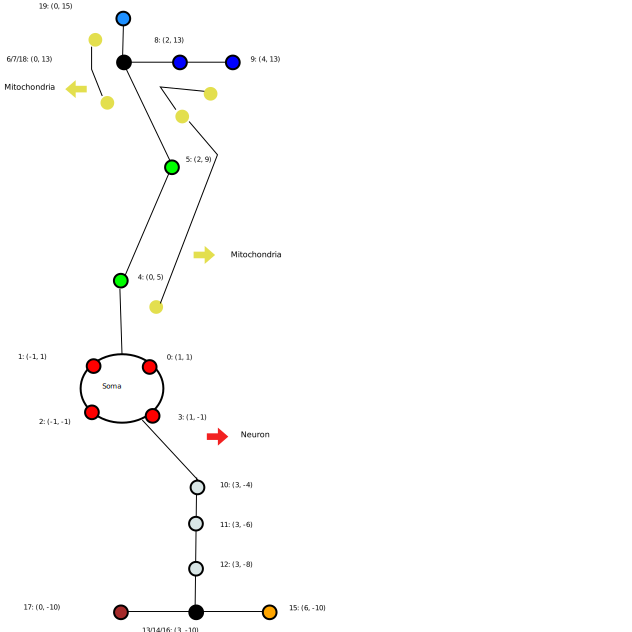
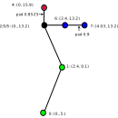

HDF5 Version 1.3 Morphology Description
=======================================

Changelog
---------
- 1.3 Added specification for Dendritic Spine.

- 1.2 Added specification for Mitochondria and Endoplasmic Reticulum morphology.

- 1.1 Added versioning to the file. Modifications to support glia cells
      (cell_family attribute and perimeter dataset).

- 1.0 Initial format documentation.

History
-------

The `HDF5v1` format was conceived internally to the BBP_ to represent
morphologies more compactly, instead of using the Neurolucida_ ASCII format.
It uses :term:`hdf5` to store all the data needed to represent a neuron
morphology.  It follows the conceptual structure of the `Neurolucida`
representation, but has a more accurate representation instead of relying on
ASCII serialization of floating point numbers.

File Format
-----------

The file contains a root `/`, with three `HDF5 Datasets` that describe the
Neuron or Glia cell morphology and dendrictic spine morphology. The `/organelles` group has 2 sub-groups
that contain information about cell organelles and one sub-group that contains dendritic spine organelles.
There is a `mitochondria` group that contains three `HDF5 Datasets` describing the mitochondria morphology
present in the cell. Similarly, there is a `endoplasmic_reticulum` group that
describes ER morphology. There is a postsynaptic_density/points dataset that describes dendritic spine PSD.
There are also attributes in the `/metadata`
group.

Note : The `organelles` group and the groups and datasets in it are optional
and are not a must for representing cell morphology. These fields may be used
when additional information about the organelles in the cell is available.

The datasets in the root `/` are:

  - `points`:
     A 4 column data set composed of 32 bit floating point numbers representing
     morphology :term:`points<point>`, which are basically the position and
     diameter at a :term:`cross section`. The first three columns represent X,
     Y, and Z positions and the last column represents the Diameter, all in
     micrometers. Implicit in the points dataset is an index, starting at 0,
     of each point.

       Note: Points on the boundaries between :term:`sections<section>`
       are duplicated, such that the start point of a child :term:`section` is
       the same as the last point of its parent :term:`section`.

       Note: The points of the soma must be the first points.

  - `structure`
     This dataset describes all the :term:`sections<section>`.
     It is composed of 3 columns: `start offset`, `type` and `parent ID`.
     Implicit in the structure dataset is an index, starting at 0, of
     each :term:`section`.

     - `start offset`: The implicit index in the `points` dataset of the
       first `point` of the section. The `points` in this :term:`section` go
       until the next `Start offset` defined by the next row in the `structure`
       dataset, except for the **last** :term:`section` in the file, then it
       runs until the end of the `points` dataset.

       Note: When there is an ambiguity as to where the initial section
       starts, as in the case of single point branches from the soma center,
       it should be taken to be the soma center.

     - `type`: The type of process for this section. This integer is
       interpreted differently depending on the cell type.

       For neurons the values are: 1: `soma`, 2: `axon`, 3: `basal dendrite`, 4: `apical dendrite`.

       For glia cells the values are: 1: `soma`, 2: `glia perivascular process`, 3 `glia process`.

       For dendritic spine the values are: 2: `neck`, 3: `head`.

       Note: If there is a soma, it should be given as the first section (the soma must contain only one section).

     - `parent index`: The implicit index into the `structure` of the parent.
       For the soma `Type`, it is set to -1, otherwise it must point to a
       **previous** :term:`section` (ie: no forward references)

  - `perimeters` (optional for neurons and dentritic spines, mandatory for glial cells):
     Glial cells are not as tubular as neurons, therefore a truncated cone representation is not sufficient to capture
     both the lateral surface area and the volume of the process segent.
     So :term:`perimeter` encode its lateral surface area.
     A 1 column data set composed of floating point numbers representing the
     :term:`perimeter` of the :term:`cross section` at each point. There is
     a one to one correspondence between this dataset and the `points` dataset.
     The unit is micrometers.
     The :term:`perimeter` for the rows corresponding to `soma` points must be set to 0.

There are 3 groups in `/organelles`:

  - `endoplasmic_reticulum`
  - `mitochondria`
  - `postsynaptic_density`

The datasets in the `organelles/endoplasmic_reticulum` group are:

  - `section_index`:
     This dataset represents the index of the :term:`section` that the ER lies
     in.

  - `volume`:
     A 1 column data set composed of floating point numbers representing the
     volume of the part of the ER lying in section referenced by the
     corresponding row in the `section_index` data set.

  - `surface_area`:
     Similar to the `volume` data set, this data set represents the surface
     area of the ER in each section in the `section_index` data set.

  - `filament_count`:
     This 1 column data set is composed of integers that represent the number
     of filaments in the segment of the ER lying in the section referenced by
     the corresponding row in the `section_index` data set.

The datasets in `organelles/mitochondria` group are:

  - `points`:
     This dataset consists of 3 columns and provides structural information
     about mitochondrial segments.

     - `section index`: The index of the section (as described in the
       `structure` dataset) that the mitochondrial segment starts in.

     - `relative distance`: The particular point (within the section defined
       in the first column) of the mitochondrial segment, as normalized
       distance in the range [0,1] from the beginning of the section.

     - `diameter`: The diameter of the mitochondrial segment at that point.

       Note : The branching points, on the boundary between 2 mitochondrial
       sections, are duplicated.

  - `structure`:
     This dataset describes the actual structure of the mitochondria by grouping
     the points described in the `mitochondria/points` dataset into mitochondrial
     sections.

     - `start offset`: The implicit index in the `mitochondria/points` dataset.
       It is similar to the `start offset` in the `/structure` dataset, as the
       points in this mitochondria go until the next `start offset` described
       by the next row in the `mitochondria/structure` dataset, except for the
       **last** mitochondria section in the file, then it runs until the end of
       the `mitochondria/structure` dataset.

     - `parent index`: This index number is similar to the `parent index` in
       the `/structure` dataset. It refers to the implicit index in the
       `structure` of the parent, and points to the **previous** mitochondrial
       section it is linked to. For each new mitochondria that is not linked to
       any other section, it is set to -1.

The datasets in the organelles/postsynaptic_density group are:

  - `section_index` (int): This column represents the index of the section that the PSD lies in.

  - `segment_index` (int): This column represents the index of the segment within the section that PSD lies in.

  - `offset` (float): This column represents the fraction of the segment where the PSD is located.

The attributes in the `/metadata` group are:

  - `cell_family_enum`: An H5 enum that can take the values NEURON, GLIA or SPINE.
     Inside each family there can be multiple types, this classification is out
     of the scope of this file.

  - `cell_family`: An H5 attribute of type `cell_family_enum`: States the
     family that the morphology belongs to. Prior version 1.1, the cell family
     is assumed to be NEURON. As of version 1.3, the cell family can be `SPINE`.

  - `creator`: The software used to create the morphology.

  - `creation_time`: date & time when the file was written

  - `software_version`: major.minor.patch.sha1 of the software that wrote the
     file

  - `version`: An attribute array of two U32LE integers that stores the major
     and minor version numbers. The version number has to be interpreted as
     follows: Versions with different major number are not expected to be
     compatible. APIs should be able to evolve gradually to newer versions,
     but parsing code may need to be very different. When the minor version
     number is increased, the new file format is guaranteed to be backwards
     compatible with parsing code for previous versions (or the other way
     around, parsing code for a version is forward compatible with file
     format minor revisions).

Geometric interpretation
------------------------

Soma: there is only one soma section, however, different tools interpret them
differently. Note: Dendritic spine morphology has no soma:

   - The series of :term:`points<point>` belonging to this section is a
     polyline that represents the outermost contour of the soma as seen down
     the Z axis (this is not exactly a XY plane projection because not all
     points may have the same Z coordinate). The chain is closed by joining
     the last :term:`point` of the section with the first one.
   - A sphere, with the center at the geometric mean of all the points, with
     diameter of the maximum distance between two points.

Cell processes: Processes (called neurites in neurons) consists of a set of
:term:`sections<section>` organized in a tree structure where the root is the
soma, and each one consisting of a set of :term:`points<point>`. A section has
one type of process assigned as a whole. Two consecutive points in a
:term:`section` define a :term:`segment`.  A :term:`section` *must* begin at a
root point or a branching point, and end at a branching point or an end point.

The diameter at an :term:`end point<end-point>` of a segment represents the
*thickness* of the process at this point, and can be thought about as a sphere.

.. note::

   The same set of :term:`points<point>` with different indices and a
   different structure dataset may represent the same neuron. For instance,
   swapping the order of how the neurites are included in the file, give two
   equivalent representations of the same neuron with different indices. For
   that reasons no assumptions about the order of enumeration of sections should
   be made.

Endoplasmic Reticulum: The ER extends throughout the cell body as numerous
filaments. It is generally thought of as a single connected compartment. Thus,
it's morphological information includes the surface area, volume and number of
filaments, as a property of the `section` of the cell body it lies in.

Mitochondria: The mitochondria are present as tube-like structures inside the
Neuron cell body, and may extend through different sections of the neuron (Soma,
axon, dendrites). There may also be **multiple** mitochondria present within a
single neuron. Thus, they are represented as a tree-like stucture, with a
series of points (which differ in radii), organized into sections. The position
of the points are represented as a function of the :term:`section` of the
neuron they lie in. In case of branching mitochondria, multiple sections would
be required to represent them while a single section would be sufficient to
represent a mitochondria that does not branch.

Dendritic spine: Sections start at the root, a branching point or anywhere along a branch
(ie: unifurcations are allowed).
Two sections can share a single branch if they have a different section type.
A spine base is defined as the first point of the root section. The spine base begins at the dendritic shaft
and not the center of the dendrite.
Unifurcations are allowed so that for a long morphological process that does not branch different sections can still
be annotated as head and neck.
PSD: :term:`postsynaptic density` are identified on points.

Example
-------

For the example, we will be using this simplified morphology (note the shared
points in black: these are duplicated):

`points` structure (note the implicit `i` index, the colours refer to the above
diagram):

   +------+-------+-------+-------+-------+--------------+
   |   i  |   X   |   Y   |   Z   |   D   | Colour       |
   +======+=======+=======+=======+=======+==============+
   |   0  |   1   |   1   |   0   |   0   |  Red         |
   +------+-------+-------+-------+-------+              |
   |   1  |  -1   |   1   |   0   |   0   |              |
   +------+-------+-------+-------+-------+              |
   |   2  |  -1   |  -1   |   0   |   0   |              |
   +------+-------+-------+-------+-------+              |
   |   3  |   1   |  -1   |   0   |   0   |              |
   +------+-------+-------+-------+-------+--------------+
   |   4  |   0   |   5   |   0   |   2   |  Green       |
   +------+-------+-------+-------+-------+              |
   |   5  |   2   |   9   |   0   |   2   |              |
   +------+-------+-------+-------+-------+              |
   |   6  |   0   |  13   |   0   |   2   |              |
   +------+-------+-------+-------+-------+--------------+
   |   7  |   0   |  13   |   0   |   1   |  Blue        |
   +------+-------+-------+-------+-------+              |
   |   8  |   2   |  13   |   0   |   1   |              |
   +------+-------+-------+-------+-------+              |
   |   9  |   4   |  13   |   0   |   1   |              |
   +------+-------+-------+-------+-------+--------------+
   |  10  |   3   |  -4   |   0   |   2   |  Grey        |
   +------+-------+-------+-------+-------+              |
   |  11  |   3   |  -6   |   0   |   2   |              |
   +------+-------+-------+-------+-------+              |
   |  12  |   3   |  -8   |   0   |   2   |              |
   +------+-------+-------+-------+-------+              |
   |  13  |   3   |  -10  |   0   |   2   |              |
   +------+-------+-------+-------+-------+--------------+
   |  14  |   3   |  -10  |   0   |   1   | Mustard      |
   +------+-------+-------+-------+-------+              |
   |  15  |   0   |  -10  |   0   |   1   |              |
   +------+-------+-------+-------+-------+--------------+
   |  16  |   3   |  -10  |   0   |  1.5  | Maroon       |
   +------+-------+-------+-------+-------+              |
   |  17  |   6   |  -10  |   0   |  1.5  |              |
   +------+-------+-------+-------+-------+--------------+
   |  18  |   0   |   13  |   0   |   2   | Light        |
   +------+-------+-------+-------+-------+ Blue         |
   |  19  |   0   |   15  |   0   |   2   |              |
   +------+-------+-------+-------+-------+--------------+

`structure` Dataset, where `SO` is `Segment Offset`, `PID` is `Parent ID` and `TYP`
is `Type` (note the implicit `i` index):

   === === === === ==========
    i   SO TYP PID Colour
   === === === === ==========
    0   0   1  -1  Red
    1   4   2   0  Green
    2   7   2   1  Blue
    3   10  3   0  Grey
    4   14  3   3  Mustard
    5   16  3   3  Maroon
    6   18  2   1  Light Blue
   === === === === ==========

`perimeters` structure

  +------------+---+---+---+---+-----+-----+---+---+-----+-----+-----+---+---+-----+-----+-----+-----+-----+-----+
  +------------+---+---+---+---+-----+-----+---+---+-----+-----+-----+---+---+-----+-----+-----+-----+-----+-----+
  |  perimeter | 0 | 0 | 0 | 0 | 7.4 | 7.2 | 7 | 4 | 3.5 | 3.5 | 7.2 | 7 | 7 | 3.7 | 3.6 | 5.2 | 5.4 | 5.6 | 5.9 |
  +------------+---+---+---+---+-----+-----+---+---+-----+-----+-----+---+---+-----+-----+-----+-----+-----+-----+

`/organelles/mitochondria/points` Dataset

   +------+-----------+------------------+-----------+
   |   i  | SectionID | RelativeDistance |  Diameter |
   +======+===========+==================+===========+
   |   0  |     1     |        0.25      |    0.4    |
   +------+-----------+------------------+-----------+
   |   1  |     1     |        0.7       |    0.8    |
   +------+-----------+------------------+-----------+
   |   2  |     2     |        0.8       |    0.65   |
   +------+-----------+------------------+-----------+
   |   3  |     1     |        0.8       |    0.32   |
   +------+-----------+------------------+-----------+
   |   4  |     6     |        0.5       |    0.9    |
   +------+-----------+------------------+-----------+

`/organelles/mitochondria/structure` Dataset

   +-----+-------------+-----+
   |  i  | StartOffset | PID |
   +=====+=============+=====+
   |  0  |      0      | -1  |
   +-----+-------------+-----+
   |  1  |      3      |  0  |
   +-----+-------------+-----+

Dendritic spine example
-----------------------

For the example, we will be using this simplified spine morphology.

`points` structure (note the implicit `i` index, the colours refer to the above
diagram):

   +------+-------+-------+-------+-------+--------------+
   |   i  |   X   |   Y   |   Z   |   D   |              |
   +======+=======+=======+=======+=======+==============+
   |   0  |   0.  |   5.  |   0.  |   0.1 |  Green       |
   +------+-------+-------+-------+-------+              |
   |   1  |  2.4  |  9.1  |   0.  |   0.2 |              |
   +------+-------+-------+-------+-------+              |
   |   2  |   0.  |  13.2 |   0.  |  0.15 |              |
   +------+-------+-------+-------+-------+--------------+
   |   3  |   0.  |  13.2 |   0.  |  0.2  |              |
   +------+-------+-------+-------+-------+   Red        |
   |   4  |   0.  |  15.9 |   0.  | 2.4   |              |
   +------+-------+-------+-------+-------+--------------+
   |   5  |  0.   |  13.2 |   0.  |  2.3  |              |
   +------+-------+-------+-------+-------+              |
   |   6  |   2.4 |  13.2 |   0.  |  2.8  |  Blue        |
   +------+-------+-------+-------+-------+              |
   |   7  |  4.03 |  13.2 |   0.  |  2.4  |              |
   +------+-------+-------+-------+-------+--------------+

`structure` Dataset, where `SO` is `Segment Offset`, `PID` is `Parent ID` and `TYP`
is `Type` (note the implicit `i` index):

   === === === === ==========
    i   SO TYP PID Colour
   === === === === ==========
    0   0   2  -1  Green
    1   3   3   0  Red
    2   5   3   1  Blue
   === === === === ==========

`postsynaptic_density` Dataset

 /organelles/postsynaptic_density/section_id structure

   +------+-----------+
   |   i  | SectionID |
   +======+===========+
   |   0  |     1     |
   +------+-----------+
   |   1  |     2     |
   +------+-----------+

 /organelles/postsynaptic_density/segment_id structure

   +------+-----------+
   |   i  | segmentId |
   +======+===========+
   |   0  |     0     |
   +------+-----------+
   |   1  |     1     |
   +------+-----------+

 /organelles/postsynaptic_density/offset structure

   +------+-----------+
   |   i  |   Offset  |
   +======+===========+
   |  0   |  0.8525   |
   +------+-----------+
   |  1   |   .9      |
   +------+-----------+

Consumers
---------

   - `BlueBuilder <https://bbpcode.epfl.ch/code/gitweb?p=building/BlueBuilder.git;a=blob;f=bluebuilder/IO/hdf5Obj.h>`_
   - `Brion <https://github.com/BlueBrain/Brion/blob/master/brion/plugin/morphologyHDF5.h>`_
   - `Pneumatk <https://bbpteam.epfl.ch/reps/analysis/Pneumatk.git/tree/pneumatk/io/advanced/h5.py>`_
   - `TouchDetector <https://bbpcode.epfl.ch/code/gitweb?p=building/TouchDetector.git;a=blob;f=touchdetector/Hdf5Obj.h>`_
   - `NeuroM <https://bbpcode.epfl.ch/code/gitweb?p=algorithms/hbp-neurom.git;a=blob;f=neurom/io/hdf5.py;h=a557e303632e47b0ef7ad9383294741354c61d97;hb=HEAD>`_

Producers
---------
   - `morphology release`

.. _BBP: http://bluebrain.epfl.ch/
.. _Neurolucida: http://www.mbfbioscience.com/neurolucida
