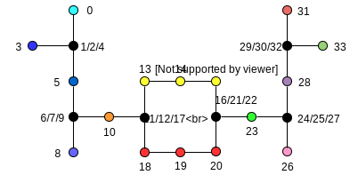

.. toctree::
   :maxdepth: 2
   :hidden:

   Home <self>
   glossary

Vasculature Morphology Description
==================================

File Format
-----------

The file contains a root `/`, with three `HDF5 Datasets` that describe the
Vasculature morphology. The `/properties` group contains datasets that describe
additional information about the vasculature at the point, segment and section
level. For example, `leakiness` would apply to the segment level.

The datasets rooted in `/` are:

  - `points`:
     A 4 column data set composed of 32 bit floating point numbers representing
     morphology :term:`points<point>`, which are the position and diameter at a
     :term:`cross section`. The first three columns represent the X, Y, and Z
     positions and the last column represents the diameter, all in micrometers.
     Implicit in the points dataset is an index, starting at 0, of each point.

       Note: Points on the boundaries between :term:`sections<section>`
       are duplicated, such that the start point of a :term:`section` 1 is the
       same as the last point of the :term:`section` that it is connected to.

  - `structure`:
     This dataset describes all the :term:`sections<section>` of the
     vasculature. It is composed of 2 columns: `start offset` and `type`.
     Implicit in the structure dataset is an index, starting at 0, of each
     :term:`section`.

     - `start offset`: The implicit index in the `points` dataset of the first
       `point` of the section. The `points` in this :term:`section` go until
       the `start offset` defined by the next row in the `structure` dataset,
       except for the **last** term:`section` in the file, then it runs until
       the end of the `points` dataset.

     - `type`: The type of process for this section. The integer can be
       interpreted as follows:

       1: `vein`, 2: `artery`, 3: `venule`, 4: `arteriole0`,
       5: `venous-capillary`, 6: `arterial-capillary`, 7: `transitional`

  - `connectivity`:
     This dataset describes the connectivity between all the sections described
     in the `structure` dataset. It has 2 columns which refer to the implicit
     index of the sections which are connected to each other. It implies that
     the last point in the section in column 1 is the same as the first point
     in the section in column 2 (duplicating points at the boundary). This
     dataset is sorted on the first column, and has a secondary sort on the
     second column.

The optional group `/properties` stores additional datasets under one of the
following groups:

  - `/properties/point_level/` for properties attached to a point.
    The datasets of this group are composed of 2 columns: `point index` and
    `value`. `point index` is a column of integers that relates to the index in
    the `/points` dataset and `value` is a column of float storing the property
    value for this point. An example of point level property could be the cross
    section surface at each point.

  - `/properties/segment_level/` for properties attached to a segment.
    The datasets are composed of 2 columns: `segment index` and `value`.
    `segment index` is a column of integers that relates to the index in the
    `/points` dataset, but is interpreted as the segment between the point at
    the point index, and the one following it. `value` is a column of float
    storing the property value for this segment. An example of segment level
    property could be the leakiness.

  - `/properties/section_level/` for properties attached to a section.
    The datasets are composed of 2 columns: `section index` and `value`.
    `section index` is a column of integers that relates to the index in the
    `/structure` dataset and `value` is a column of float storing the property
    value for this section. An example of section level property could be a
    section type.

Geometric interpretation
------------------------

The additional `connectivity` dataset is included because the vasculature is
represented as a graph, unlike the neuron which is a tree. Thus, each section
can have multiple `parents` and `children`. The directionality of the graph
is decided by the columns in the `connectivity` dataset (column 1 to column 2).

Example
-------

For example, a simple morphology with 1 branching point would be expressed as:

.. image:: _ static/ExVascMorph_junction.svg
	:alt: Example

`points` structure:

   +------+-------+-------+-------+-------+
   |   i  |   X   |   Y   |   Z   |   D   |
   +======+=======+=======+=======+=======+
   |   0  |   0   |   2   |   0   |   0   |
   +------+-------+-------+-------+-------+
   |   1  |   0   |   1   |   0   |   0   |
   +------+-------+-------+-------+-------+
   |   2  |   0   |   0   |   0   |   0   |
   +------+-------+-------+-------+-------+
   |   3  |   0   |   0   |   0   |   0   |
   +------+-------+-------+-------+-------+
   |   4  |  -1   |   0   |   0   |   0   |
   +------+-------+-------+-------+-------+
   |   5  |  -2   |   0   |   0   |   2   |
   +------+-------+-------+-------+-------+
   |   6  |   0   |   0   |   0   |   2   |
   +------+-------+-------+-------+-------+
   |   7  |   1   |   0   |   0   |   2   |
   +------+-------+-------+-------+-------+
   |   8  |   2   |   0   |   0   |   1   |
   +------+-------+-------+-------+-------+

`structure` dataset, where `SO` is `start offset` and `TYP` is `Type` (`i` is
the implicit index):

   === === ===
    i   SO TYP
   === === ===
    0   0   1
    1   3   1
    2   6   1
   === === ===

`connectivity` dataset where `S1` is section1 and `S2` is section2:

   === ===
    S1  S2
   === ===
    0   1
    0   2
   === ===

Another example, using a more complex  morphology (the shared points in black
are duplicating):

`points` structure (note the implicit `i` index):

   +------+-------+-------+-------+-------+
   |   i  |   X   |   Y   |   Z   |   D   |
   +======+=======+=======+=======+=======+
   |   0  |  -2   |   3   |   0   |   0   |
   +------+-------+-------+-------+-------+
   |   1  |  -2   |   2   |   0   |   0   |
   +------+-------+-------+-------+-------+
   |   2  |  -2   |   2   |   0   |   0   |
   +------+-------+-------+-------+-------+
   |   3  |  -3   |   2   |   0   |   0   |
   +------+-------+-------+-------+-------+
   |   4  |  -2   |   2   |   0   |   0   |
   +------+-------+-------+-------+-------+
   |   5  |  -2   |   1   |   0   |   2   |
   +------+-------+-------+-------+-------+
   |   6  |  -2   |   0   |   0   |   2   |
   +------+-------+-------+-------+-------+
   |   7  |  -2   |   0   |   0   |   2   |
   +------+-------+-------+-------+-------+
   |   8  |  -2   |  -1   |   0   |   1   |
   +------+-------+-------+-------+-------+
   |   9  |  -2   |   0   |   0   |   2   |
   +------+-------+-------+-------+-------+
   |  10  |  -1   |   0   |   0   |   2   |
   +------+-------+-------+-------+-------+
   |  11  |   0   |   0   |   0   |   2   |
   +------+-------+-------+-------+-------+
   |  12  |   0   |   0   |   0   |   2   |
   +------+-------+-------+-------+-------+
   |  13  |   0   |   1   |   0   |   2   |
   +------+-------+-------+-------+-------+
   |  14  |   1   |   1   |   0   |   1   |
   +------+-------+-------+-------+-------+
   |  15  |   2   |   1   |   0   |   1   |
   +------+-------+-------+-------+-------+
   |  16  |   2   |   0   |   0   |  1.5  |
   +------+-------+-------+-------+-------+
   |  17  |   0   |   0   |   0   |   2   |
   +------+-------+-------+-------+-------+
   |  18  |   0   |  -1   |   0   |   2   |
   +------+-------+-------+-------+-------+
   |  19  |   1   |  -1   |   0   |   2   |
   +------+-------+-------+-------+-------+
   |  20  |   2   |  -1   |   0   |   0   |
   +------+-------+-------+-------+-------+
   |  21  |   2   |   0   |   0   |  1.5  |
   +------+-------+-------+-------+-------+
   |  22  |   2   |   0   |   0   |  1.5  |
   +------+-------+-------+-------+-------+
   |  23  |   3   |   0   |   0   |   0   |
   +------+-------+-------+-------+-------+
   |  24  |   4   |   0   |   0   |   2   |
   +------+-------+-------+-------+-------+
   |  25  |   4   |   0   |   0   |   2   |
   +------+-------+-------+-------+-------+
   |  26  |   4   |  -1   |   0   |   2   |
   +------+-------+-------+-------+-------+
   |  27  |   4   |   0   |   0   |   1   |
   +------+-------+-------+-------+-------+
   |  28  |   4   |   1   |   0   |   1   |
   +------+-------+-------+-------+-------+
   |  29  |   4   |   2   |   0   |   1   |
   +------+-------+-------+-------+-------+
   |  30  |   4   |   2   |   0   |   1   |
   +------+-------+-------+-------+-------+
   |  31  |   4   |   3   |   0   |   2   |
   +------+-------+-------+-------+-------+
   |  32  |   4   |   2   |   0   |   2   |
   +------+-------+-------+-------+-------+
   |  33  |   5   |   2   |   0   |   1   |
   +------+-------+-------+-------+-------+

`structure` dataset, where `SO` is `start offset` and `TYP` is `Type` (`i` is
the implicit index):

   === === ===
    i   SO TYP
   === === ===
    0   0   1
    1   2   1
    2   4   1
    3   7   1
    4   9   3
    5   12  7
    6   17  7
    7   22  4
    8   25  2
    9   27  2
    10  30  2
    11  32  2
   === === ===

`connectivity` dataset where `S1` is section1 and `S2` is section2:

   === ===
    S1  S2
   === ===
    0   1
    0   2
    2   3
    2   4
    4   5
    4   6
    5   7
    6   7
    7   8
    7   9
    9   10
    9   11
   === ===
